# 时间管理工具设计文档

## 第一部分：概述

### 1.1 项目背景

市面上现有的时间管理与记忆管理工具（Anki、TickTick、Obsidian 插件等）彼此割裂：日历、任务、记忆算法、笔记各自独立，无法形成统一的工作流。用户需要在不同应用间手动搬运数据，输入成本高。本项目的核心开发动机便是填补这一空白——打造一个本地优先、输入成本极低的个人时间管理工具。

### 1.2 当前项目目标

· 管理学习内容的层级分类树
· 以自由计时模式跟踪学习投入，支持暂停和参数记录
· 基于 FSRS 等间隔重复算法自动预测下一次复习时间
· 提供复习看板，展示待复习任务及其紧迫度
· 保持用户数据完全本地化，并可导出为透明格式供第三方使用

### 1.3 项目设计理念

· 本地优先与用户控制：所有数据存储在本地文件中，用户拥有完全的所有权和迁移自由。
· 低输入成本：尽可能自动化时间记录，用户只需点击开始/结束，无需手动填写时长。
· 做好一件事：专注于时间管理。

### 1.4 开发路线图

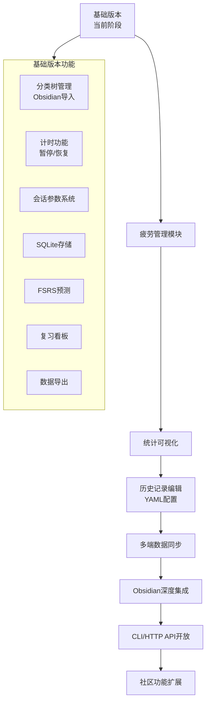

· 疲劳管理模块：连续学习提醒 + 主观疲劳标记 + 今日疲劳指数
· 统计可视化：日/周学习时长统计、分类占比、日历热力图
· 历史记录编辑：手动编辑历史学习记录、调整分类树、YAML配置文件支持
· 多端数据同步：通过文件同步工具或自建轻量同步服务
· Obsidian深度集成：双向链接、笔记内复习进度展示
· CLI/HTTP API开放：供大模型Agent调用
· 习惯追踪、时间预算等

## 第二部分：需求

### 2.1 功能模块划分

系统按功能划分为以下模块：
· 学习时间管理模块（当前开发重点）
· 数据管理模块
· 用户设置模块

### 2.2 学习时间管理模块

#### 2.2.1 分类树管理

· 支持多层级树形结构，例如"语言 > 英语 > 六级 > 单词 > Unit1"。
· 可从 Obsidian 知识库文件夹结构导入生成分类树。
· 支持手动创建、重命名、删除节点。
· 允许在会话时将主题关联到特定节点。

#### 2.2.2 计时功能

· 用户选择节点后，点击"开始"启动计时（自由计时模式，无固定时长限制）。
· 支持暂停/恢复，暂停期间不计入有效时长。
· 用户主动停止后，记录有效时长（不含暂停时间）、开始/结束时间、关联节点。
· 计时过程中参数使用默认值，不显示参数面板，保持专注。结束计时后弹出确认窗口，用户可修改参数。
· 计时页面实时显示当前节点名称和已用有效时间。

#### 2.2.3 会话记录存储

· 所有会话持久化存储，包含时间、节点、手动备注等字段。
· 提供手动编辑调整的入口（修改起止时间、关联节点、备注）。
· 数据存储采用 SQLite，并可定期导出为 JSONL/CSV 存档。

#### 2.2.4 预测算法支持

· 预测算法通过抽象接口支持多种后端（当前集成FSRS，预留SM-2等扩展）。
· 每次会话结束后，将原始会话数据（含所有用户记录参数）传递给算法后端。
· 算法后端负责将原始参数映射到自身参数体系（如FSRS的rating、stability等）。
· 为每个节点维护预测状态（如FSRS的卡片状态），支持算法自优化。
· 原始会话数据独立存储，不受算法变更影响，可重新运行不同算法。

#### 2.2.5 复习看板

· 展示所有待复习节点，按下次复习日期紧迫度排序。
· 过期未复习节点高亮提醒。
· 看板可直接跳转到该节点的计时页。

### 2.3 数据管理模块

#### 2.3.1 数据导出与存档

· 提供一键导出会话记录和预测状态为 JSONL、CSV 或 Markdown 表格。
· 导出文件存放在用户指定目录，完全透明，可被第三方工具读取。

### 2.4 用户设置模块

#### 2.4.1 用户设置

· 可配置连续学习提醒阈值。

### 2.5 业务流程图

#### 2.5.1 会话完整流程

1. 用户打开应用，加载分类树。
2. 选择节点（或通过复习看板直接进入）。
3. 双击节点，计时器启动，加载默认参数。
4. 可随时暂停/恢复。
5. 点击"结束"，弹出会话确认窗口，确认参数后保存，系统调用预测算法更新状态。
6. 看板自动刷新，显示新的复习规划。

#### 2.5.2 Obsidian 导入流程

1. 用户在设置中指定 Obsidian 仓库路径。
2. 点击"导入"，系统遍历文件夹，忽略隐藏目录和配置文件。
3. 按目录结构生成分类树节点。
4. 如果仓库内容变化，用户可手动触发重新导入，节点增量更新。

#### 2.5.3 复习看板交互流程

1. 用户打开"复习"视图。
2. 系统查询prediction_states，筛选临近复习日期的记录。
3. 按时间升序排列展示，过期项红色标记。
4. 单击节点展开详情面板，点击"开始计时"进入计时界面。

#### 2.5.4 数据导出流程

1. 用户进入设置/数据管理。
2. 选择导出格式（JSONL/CSV/Markdown）。
3. 点击"导出"，系统查询数据库并写入文件。
4. 提示导出成功，并显示文件路径。


## 第三部分：技术选型及理由

| 组件 | 选择 | 理由 |
|------|------|------|
| 编程语言 | Rust | 内存安全、高性能、强类型系统，适合开发需长期维护的个人工具。 |
| GUI 框架 | Iced 0.14 | 纯 Rust 原生跨平台 GUI，架构受 Elm 启发（TEA），清晰的状态管理，无额外 Web 运行时依赖。 |
| 数据库 | rusqlite (SQLite) | 嵌入式、零配置、单文件存储，支持复杂 SQL 查询，完全满足个人级数据量和复习看板查询需求。 |
| 预测算法 | fsrs (Rust 库) + 抽象接口 | 通过 PredictionAlgorithm trait 抽象，当前集成 FSRS（Anki 最新算法），预留其他算法扩展。原始数据独立存储，算法负责参数映射。 |
| Obsidian 解析 | walkdir + 自定义 Markdown 标题解析 | 只需读取目录结构和文件名，不解析笔记内容，轻量高效。 |
| 测试框架 | Rust 内置 #[test] + 手动测试 | 单元测试、集成测试无需额外框架。CLI 调试接口使用 clap 解析命令。 |
| 打包 | 手动 cargo build --release + 归档 | 编译为单一可执行文件，平台无关，无需安装程序。 |

## 第四部分：软件总体架构

### 模块架构

系统从功能上分解为以下模块：

**全局模块：**
· UI 模块：负责界面渲染、用户交互、状态展示。
· 数据访问模块：SQLite 数据库读写、存档文件导出。
· 设置模块：全局参数默认值管理、用户配置。
· CLI操作接口模块：提供命令行操控和状态查询。

**功能模块（modules目录）：**
· 学习时间管理模块（learning）：当前开发重点，包含以下子模块：
  - 计时子模块：计时状态机、会话管理、参数系统。
  - 分类树子模块：树形结构管理、Obsidian导入解析。
  - 预测算法子模块：算法抽象接口、FSRS等后端实现、参数映射逻辑。


### 架构图

```
┌─────────────────────────────────────────────────────────────────┐
│                        time-manager                             │
├─────────────────────────────────────────────────────────────────┤
│                                                                 │
│  ┌────────────────────────────────────────────────────────┐     │
│  │                    全局模块                            │     │
│  │  ┌─────────┐  ┌─────────┐  ┌─────────┐  ┌─────────┐    │     │
│  │  │   UI    │  │  Data   │  │ Settings│  │   CLI   │    │     │
│  │  │  模块   │  │  模块   │  │  模块   │  │  模块   │    │     │
│  │  └────┬────┘  └────┬────┘  └────┬────┘  └────┬────┘    │     │
│  └───────┼────────────┼────────────┼────────────┼─────────┘     │
│          │            │            │            │               │
│  ┌───────┴────────────┴────────────┴────────────┴─────────┐     │
│  │                      功能模块                          │     │
│  │  ┌─────────────────────────────────────────────────┐   │     │
│  │  │            学习时间管理模块 (learning)          │   │     │
│  │  │                                                 │   │     │
│  │  │  ┌──────────┐  ┌──────────┐  ┌──────────┐       │   │     │
│  │  │  │  timer   │  │ category │  │prediction│       │   │     │
│  │  │  └──────────┘  └──────────┘  └──────────┘       │   │     │
│  │  └─────────────────────────────────────────────────┘   │     │
│  └────────────────────────────────────────────────────────┘     │
│                                                                 │
└─────────────────────────────────────────────────────────────────┘
```

### 模块思维导图

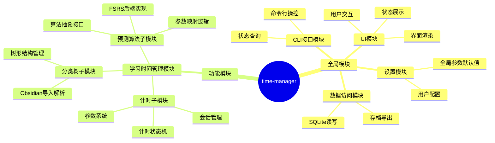
## 第五部分：详细设计

### 5.1 项目目录结构

```
time-manager/
├── Cargo.toml
├── src/
│   ├── main.rs                    # 入口，初始化 Iced 应用
│   ├── main_window.rs             # 主窗口布局
│   ├── bin/
│   │   └── tmd-cli.rs             # 调试 CLI 入口
│   ├── modules/                   # 模块目录
│   │   └── learning/              # 学习时间管理模块
│   │       ├── mod.rs
│   │       ├── timer/             # 计时子模块
│   │       │   ├── mod.rs
│   │       │   ├── session.rs             # 会话管理
│   │       │   ├── state_machine.rs       # 计时状态机
│   │       │   ├── params.rs              # 参数系统
│   │       │   └── ui/
│   │       │       ├── mod.rs
│   │       │       ├── timer_view.rs      # 计时视图
│   │       │       └── params_panel.rs    # 参数面板
│   │       ├── category/          # 分类树子模块
│   │       │   ├── mod.rs
│   │       │   ├── tree.rs                # 树形结构管理
│   │       │   ├── ui/
│   │       │   │   ├── mod.rs
│   │       │   │   └── tree_view.rs       # 分类树控件
│   │       │   └── obsidian/              # Obsidian导入
│   │       │       ├── mod.rs
│   │       │       └── vault_parser.rs
│   │       └── prediction/        # 预测算法子模块
│   │           ├── mod.rs
│   │           ├── algorithm.rs           # PredictionAlgorithm trait定义
│   │           ├── fsrs/                  # FSRS实现
│   │           │   ├── mod.rs
│   │           │   ├── adapter.rs         # FSRS适配器
│   │           │   ├── mapper.rs          # 参数映射
│   │           │   └── state.rs           # FSRS状态封装
│   │           └── ui/
│   │               ├── mod.rs
│   │               └── review_dashboard.rs # 复习看板视图
│   ├── data/                      # 数据访问模块（全局共享）
│   │   ├── mod.rs
│   │   ├── database.rs            # SQLite操作
│   │   ├── models.rs              # 数据模型定义
│   │   └ export.rs                # 导出功能
│   ├── settings/                  # 设置模块（全局共享）
│   │   ├── mod.rs
│   │   ├── defaults.rs            # 默认参数管理
│   │   └── ui/
│   │       ├── mod.rs
│   │       └ settings_view.rs    # 设置界面
│   └── cli/                       # CLI接口
│       ├── mod.rs
│       └ commands.rs             # 命令定义与执行
└── tests/
    ├── integration_tests.rs
    └ prediction_tests.rs        # 预测算法测试
```

### 5.2 设计模式应用

| 模式 | 应用场景 | 具体实现 |
|------|----------|----------|
| 状态模式 | 计时状态管理 | 定义 TimerState trait，实现 Running、Paused、Idle 三个状态结构体。TimerStateMachine 上下文持有当前状态对象并委托调用。状态转换触发时间戳记录，用于计算有效时长。 |
| 策略模式 | 预测算法可替换 | 定义 PredictionAlgorithm trait，包含 predict_next_review() 和 update_model() 方法。当前提供 FsrsAdapter 实现，未来可添加 Sm2Adapter 等。各算法从原始会话数据获取参数，通过 Mapper 模块负责参数映射逻辑，实现算法与原始数据的解耦。 |
| 适配器模式 | 参数映射 | 各算法后端实现独立的 ParamMapper，将通用会话参数（质量、难度等）映射到算法特定参数（如FSRS的rating、stability）。确保原始数据格式统一，算法可独立演进。 |
| 命令模式 | CLI 接口 | 每个 CLI 命令封装为 Command trait 实现，包含 execute(&mut Context) 方法。支持命令历史记录、参数校验、错误处理。CLI 解析器根据命令名调用对应实现。 |
| 工厂模式 | 对象创建 | SessionFactory 根据节点ID、时间戳、参数创建 Session 对象；PredictionStateFactory 根据算法类型创建对应的预测状态对象。封装复杂创建逻辑，统一初始化流程。 |
| 观察者模式 | UI 状态同步 | 计时状态变化、会话结束、预测更新等事件通过 EventBus 发布。UI 组件订阅相关事件，自动刷新显示。支持事件过滤、优先级排序。 |
| 组合模式 | 分类树结构 | CategoryNode 实现树形递归结构，支持 add_child()、remove_child()、find_by_path() 等操作。统一处理单个节点和子树，简化遍历和查询逻辑。 |
| 模板方法模式 | 数据导出 | Exporter 定义导出流程骨架（查询数据 → 格式化 → 写入文件 → 返回路径）。JsonExporter、CsvExporter、MarkdownExporter 实现具体格式化步骤。复用通用流程，扩展输出格式。 |

### 5.3 核心时序图

#### 5.3.1 开始计时 → 结束计时 → 数据更新

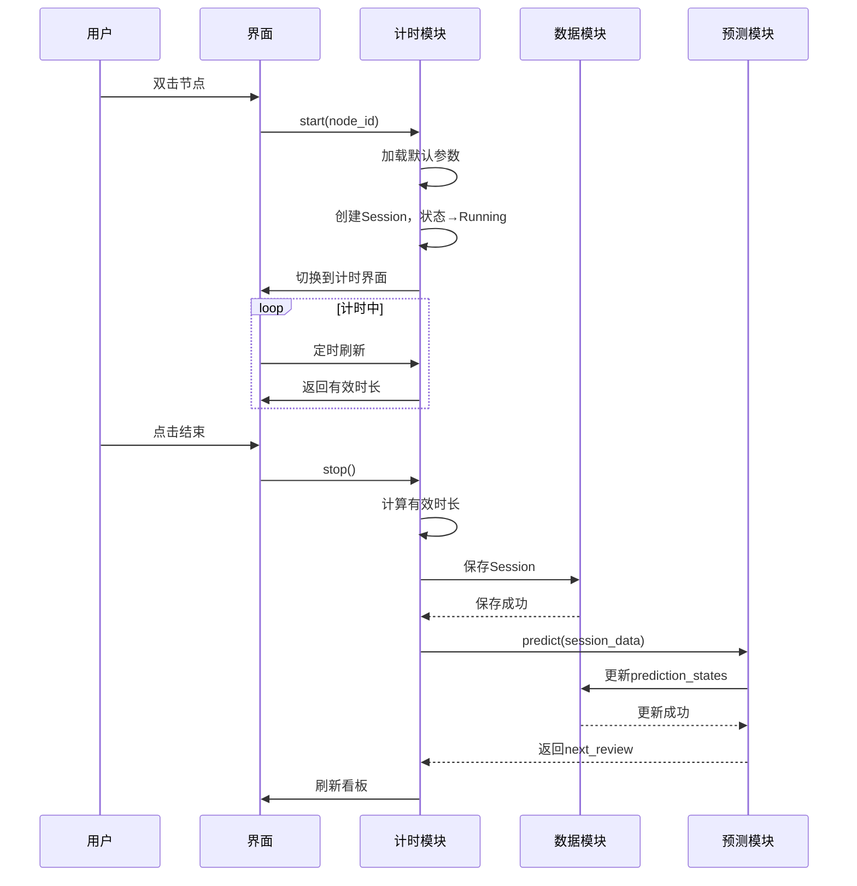

#### 5.3.2 复习看板查询

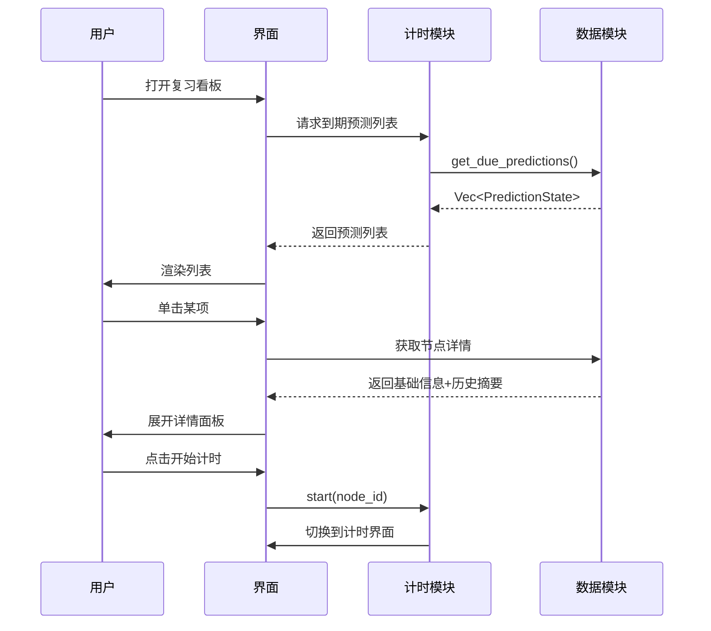

### 5.4 状态图

#### 5.4.1 计时状态机

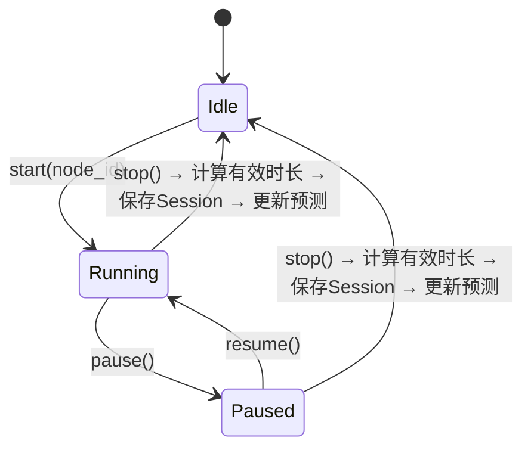

**状态转换数据变化：**

| 转换 | 触发条件 | 数据变化 |
|------|----------|----------|
| Idle→Running | start(node_id) | 创建Session，记录start_time，初始化参数 |
| Running→Paused | pause() | 记录pause_start_time |
| Paused→Running | resume() | 记录pause_end_time，累加暂停时长 |
| Running/Paused→Idle | stop() | 计算duration_secs，弹出确认窗口，保存后调用预测算法 |

#### 5.4.2 预测状态流转

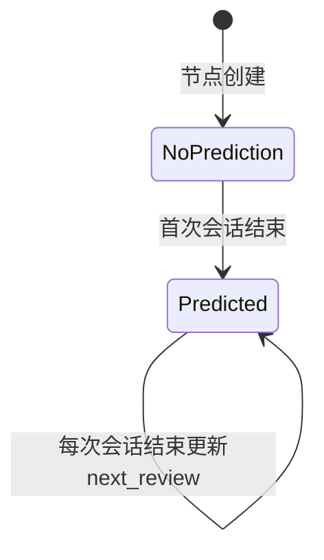

### 5.5 会话参数系统设计

#### 5.5.1 原始参数定义

| 参数名 | 类型 | 可选值 | 说明 | 采集时机 |
|--------|------|--------|------|----------|
| 学习质量 | 5级枚举 | 极低/低/中/高/完整 | 反映专注度与理解程度 | 过程中可调整，结束时可确认 |
| 理解难度 | 5级枚举 | 极易/易/中/难/极难 | 内容理解门槛 | 开始时可预设 |
| 记忆难度 | 5级枚举 | 极易/易/中/难/极难 | 内容记忆负荷 | 开始时可预设 |
| 完成度 | 百分比 | 0-100% | 计划内容完成比例 | 结束时填写 |

#### 5.5.2 参数默认值层级

参数默认值采用两级覆盖机制：

```
全局默认参数（settings表）
    └── 节点覆盖参数（categories表扩展字段）
```

查询逻辑：优先使用节点设置值，缺失则回退到全局默认。

#### 5.5.3 参数预设系统

参数预设是特定参数值的组合，用户可在会话确认窗口快速应用。

**预设数据结构：**

| 字段 | 类型 | 说明 |
|------|------|------|
| name | TEXT | 预设名称（如"专注学习"） |
| quality | TEXT | 学习质量默认值 |
| understanding_difficulty | TEXT | 理解难度默认值 |
| memory_difficulty | TEXT | 记忆难度默认值 |
| completion_rate | INTEGER | 完成度默认值 |

**存储方式：** settings表中以JSON格式存储，key为"presets"，value为预设列表的JSON数组。

**内置预设定义：**

| 预设名 | 学习质量 | 理解难度 | 记忆难度 | 完成度 | 适用场景 |
|--------|----------|----------|----------|--------|----------|
| 专注学习 | 高 | 中 | 中 | 100% | 深度学习新知识 |
| 轻松复习 | 中 | 易 | 易 | 80% | 日常复习已掌握内容 |
| 快速浏览 | 低 | 易 | 易 | 50% | 快速过一遍不深入 |

用户可在设置界面管理预设（新建、编辑、删除），也可在会话确认窗口选择预设后微调。

#### 5.5.4 预测算法抽象接口

```rust
/// 预测算法trait，支持多种后端实现
pub trait PredictionAlgorithm: Send + Sync {
    /// 根据会话历史和当前参数预测下次复习时间
    fn predict_next_review(
        &self,
        session_history: &[Session],
        current_state: &PredictionState,
        session_params: &SessionParams,
    ) -> DateTime<Utc>;
    
    /// 更新算法模型参数（基于历史数据自优化）
    fn update_model(&mut self, sessions: &[Session]);
    
    /// 算法名称标识
    fn algorithm_name(&self) -> &'static str;
}
```

#### 5.5.5 FSRS参数映射示例

| 原始参数 | FSRS映射方式 |
|----------|--------------|
| 学习质量 | Rating映射：极低→Again(1), 低→Again(1), 中→Hard(2), 高→Good(3), 完整→Easy(4) |
| 记忆难度 | 影响初始stability：极难→低stability，极易→高stability |
| 理解难度 | 影响初始difficulty：极难→高difficulty |

具体映射公式在实现时根据fsrs库API确定。

### 5.6 ER 图与数据模型

#### 实体关系图

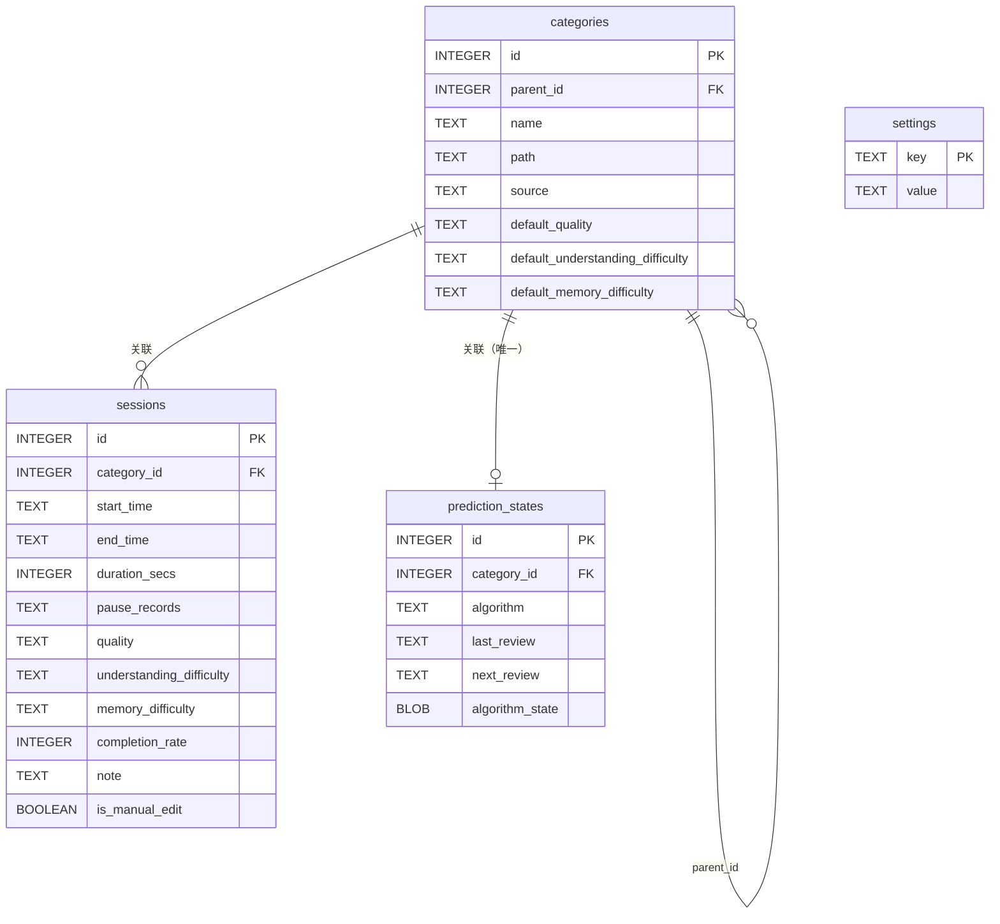
#### 存档文件格式

· sessions.jsonl：每行一个 JSON 对象，包含 id, category_path, start_time, end_time, duration_secs, pause_records, quality, understanding_difficulty, memory_difficulty, completion_rate, note。
· prediction_states.csv：表头 category_path, algorithm, last_review, next_review。

### 5.7 UI 设计描述

#### 5.7.1 设计理念

基于最小输入成本原则，界面采用全屏分离设计，每个界面专注单一功能。用户通过底部导航栏和快捷键切换界面。

#### 5.7.2 分类树界面

```
┌──────────────────────────────────────────────────────────────────┐
│  分类树                                          [搜索] [导入]    │
├──────────────────────────────────────────────────────────────────┤
│                                                                  │
│  📁 语言                                                         │
│    └ 📁 英语                                                     │
│        └ 📁 六级                                                 │
│            ├ 📄 单词                                             │
│            └ 📄 语法                                             │
│    └ 📁 日语                                                     │
│  📁 数学                                                         │
│    └ 📁 微积分                                                   │
│        └ 📄 极限                                                 │
│  📁 编程                                                         │
│    └ 📁 Rust                                                     │
│        ├ 📄 所有权                                               │
│        └ 📄 生命周期                                             │
│                                                                  │
│                                                                  │
│                                                                  │
├──────────────────────────────────────────────────────────────────┤
│  [分类树]  [复习看板]  [计时]                                    │
└──────────────────────────────────────────────────────────────────┘
```

**交互方式：**
- 单击节点：选中节点（高亮显示）
- 双击节点：直接进入计时界面并启动计时
- 右键节点：弹出菜单（重命名、删除、添加子节点）
- 快捷键N：弹出新建节点对话框
- 快捷键1/2/3：切换界面

#### 5.7.3 复习看板界面

```
┌──────────────────────────────────────────────────────────────────┐
│  复习看板                                          [刷新] [筛选]  │
├──────────────────────────────────────────────────────────────────┤
│                                                                  │
│  ┌─────────────────────┬─────────────────────────────────────┐  │
│  │ 节点列表             │ 详情面板                            │  │
│  │                     │                                     │  │
│  │ 🔴 单词/Unit1       │ 节点: 语言/英语/六级/单词/Unit1      │  │
│  │    已过期 2 天      │                                     │  │
│  │                     │ 上次复习: 2026-05-25                │  │
│  │ 🔴 微积分/极限      │ 下次复习: 2026-05-23 (已过期)       │  │
│  │    已过期 1 天      │                                     │  │
│  │                     │ ─────────────────────               │  │
│  │ 🟡 Rust/所有权      │ 历史摘要:                           │  │
│  │    今日到期         │ 会话次数: 12 次                     │  │
│  │                     │ 总学习时长: 3小时45分               │  │
│  │ ⚪ 英语/语法        │ 平均时长: 18 分钟                   │  │
│  │    明日到期         │                                     │  │
│  │                     │ ─────────────────────               │  │
│  │ ⚪ Rust/生命周期    │                                     │  │
│  │    3 天后           │       [开始计时]                    │  │
│  │                     │                                     │  │
│  └─────────────────────┴─────────────────────────────────────┘  │
│                                                                  │
│  图例: 🔴 过期  🟡 今日到期  ⚪ 未来                              │
│                                                                  │
├──────────────────────────────────────────────────────────────────┤
│  [分类树]  [复习看板]  [计时]                                     │
│    (1)      (2)      (3)                                         │
└──────────────────────────────────────────────────────────────────┘
```

**交互方式：**
- 单击节点：左侧选中，右侧展开详情面板
- 点击"开始计时"按钮：进入计时界面并启动计时
- 快捷键1/2/3：切换界面

#### 5.7.4 计时界面

```
┌──────────────────────────────────────────────────────────────────┐
│                                                                  │
│                                                                  │
│           当前节点: 语言 > 英语 > 六级 > 单词 > Unit1            │
│                                                                  │
│                         ┌─────────────┐                          │
│                         │             │                          │
│                         │  01:23:45   │                          │
│                         │             │                          │
│                         │  有效时长   │                          │
│                         │             │                          │
│                         └─────────────┘                          │
│                                                                  │
│                                                                  │
│              [暂停]              [结束]                           │
│                                                                  │
│                                                                  │
│                                                                  │
├──────────────────────────────────────────────────────────────────┤
│  [分类树]  [复习看板]  [计时]                                     │
│    (1)      (2)      (3)                                         │
└──────────────────────────────────────────────────────────────────┘
```

**设计原则：**
- 计时过程不显示参数面板，保持专注
- 参数使用默认值，结束时可修改
- 中央大号数字显示有效时长
- 极简布局，减少干扰

**交互方式：**
- 暂停/继续按钮：切换计时状态
- 结束按钮：弹出会话确认窗口
- 快捷键1/2：切换到分类树/复习看板（3保持当前计时）

#### 5.7.5 会话确认窗口

```
┌──────────────────────────────────────────────────────────────────┐
│  会话记录确认                                                    │
├──────────────────────────────────────────────────────────────────┤
│  节点: 语言/英语/六级/单词/Unit1                                  │
│  有效时长: 01:23:45                                              │
│                                                                  │
│  ──────────────────────────────────────────────────────────────  │
│  参数设置 (当前值 / 默认值)                                       │
│                                                                  │
│  学习质量:      [极低] [低] [中] ✓ [高] [完整]    默认: 中       │
│  理解难度:      [极易] [易] [中] ✓ [难] [极难]    默认: 中       │
│  记忆难度:      [极易] [易] ✓ [中] [难] [极难]    默认: 中       │
│  完成度:        [========100%========]            默认: 100%     │
│                                                                  │
│  ──────────────────────────────────────────────────────────────  │
│  预设选择:                                                       │
│  [专注学习]  [轻松复习]  [快速浏览]  [自定义]                     │
│                                                                  │
│                    [取消]        [保存并退出]                     │
└──────────────────────────────────────────────────────────────────┘
```

**功能说明：**
- 显示完整参数列表，当前值和默认值对比
- 预设选择：快速应用常用参数组合
- 保存后退出：返回分类树或复习看板界面
- 用户可在历史记录中后续编辑此会话

#### 5.7.6 设置界面

```
┌──────────────────────────────────────────────────────────────────┐
│  设置                                                            │
├──────────────────────────────────────────────────────────────────┤
│  [通用]  [参数默认值]  [算法]  [数据]                             │
├──────────────────────────────────────────────────────────────────┤
│                                                                  │
│  当前标签页: 参数默认值                                           │
│                                                                  │
│  ┌────────────────────────────────────────────────────────────┐ │
│  │ 全局默认参数                                                │ │
│  │                                                            │ │
│  │ 学习质量:        [中        ▼]                             │ │
│  │ 理解难度:        [中        ▼]                             │ │
│  │ 记忆难度:        [中        ▼]                             │ │
│  │ 完成度:          100%                                       │ │
│  │                                                            │ │
│  │ 预设管理:                                                  │ │
│  │ [专注学习]  [轻松复习]  [快速浏览]  [+新建预设]            │ │
│  │                                                            │ │
│  │                                           [恢复默认] [保存] │ │
│  └────────────────────────────────────────────────────────────┘ │
│                                                                  │
├──────────────────────────────────────────────────────────────────┤
│  [分类树]  [复习看板]  [计时]                                     │
│    (1)      (2)      (3)                                         │
└──────────────────────────────────────────────────────────────────┘
```

#### 5.7.7 界面导航与快捷键

| 操作 | 方式 | 说明 |
|------|------|------|
| 切换到分类树 | 底部导航栏点击 或 快捷键1 | 显示分类树界面 |
| 切换到复习看板 | 底部导航栏点击 或 快捷键2 | 显示复习看板界面 |
| 切换到计时 | 底部导航栏点击 或 快捷键3 | 若无计时则无操作，若有计时显示计时界面 |
| 新建节点 | 快捷键N 或 右键菜单 | 弹出新建节点对话框 |
| 启动计时 | 双击节点 | 从分类树或复习看板进入计时 |
| 暂停/继续计时 | 界面按钮 或 快捷键Space | 计时界面内操作 |
| 结束计时 | 界面按钮 或 快捷键Enter | 弹出会话确认窗口 |
| 打开设置 | 快捷键S 或 菜单 | 进入设置界面 |

### 5.8 程序流程图

#### 5.8.1 会话完整流程

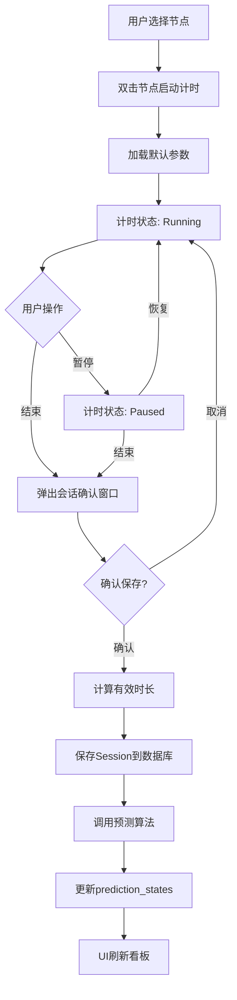

#### 5.8.2 复习看板查询流程

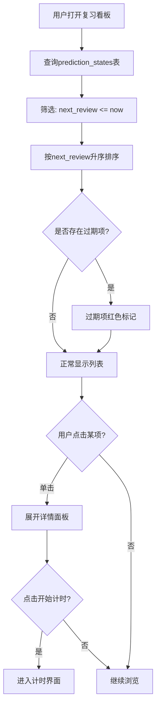

#### 5.8.3 Obsidian导入流程

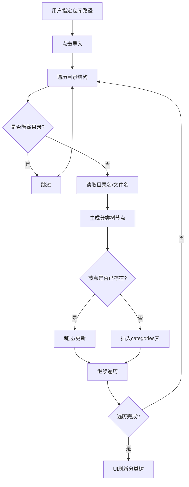

#### 5.8.4 数据导出流程

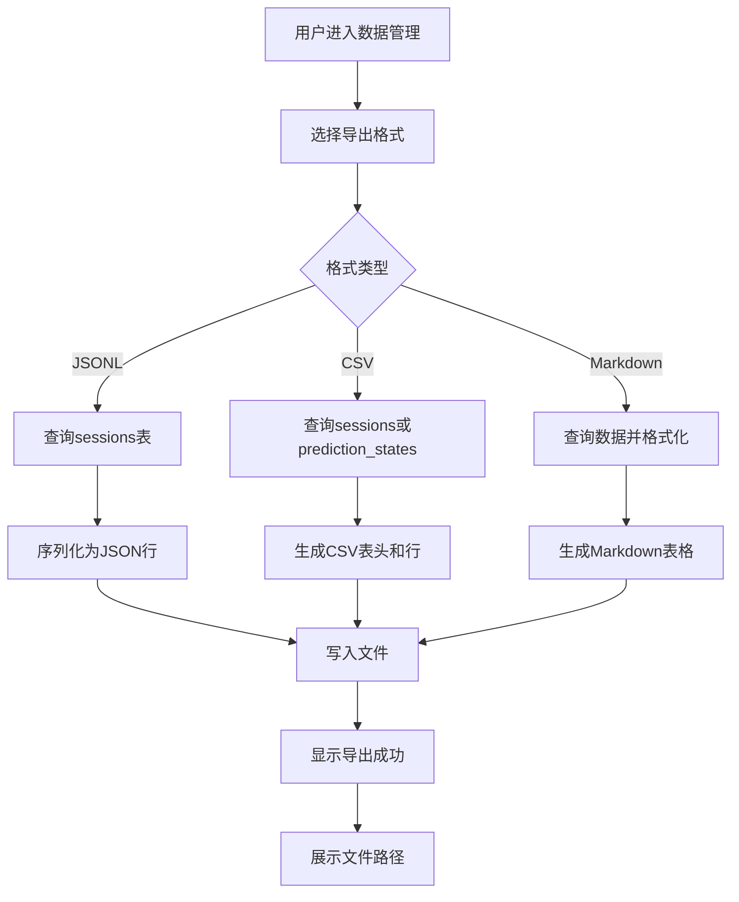

#### 5.8.5 会话确认窗口流程

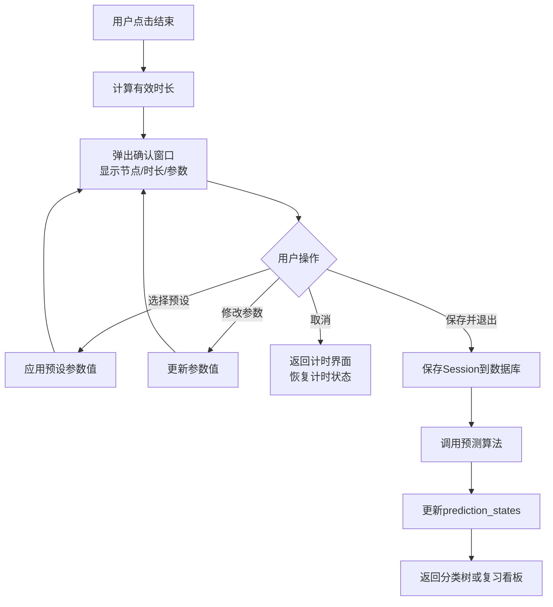


## 第六部分：测试

### 6.1 单元测试

· 计时状态机：测试状态转换合法性，有效时长计算准确性。
· 预测算法：测试FSRS适配器的参数映射逻辑、预测输出合理性。
· 参数系统：测试默认值层级覆盖机制、参数有效性校验。
· 数据访问层：测试 CRUD 操作、边界条件（空查询、错误 ID）。
· Obsidian 解析器：使用临时目录模拟仓库，验证解析出的树结构。

### 6.2 集成测试

· 完整会话流程：从开始到结束，验证会话记录写入、参数保存、预测状态更新。
· 复习看板查询：模拟插入不同日期的预测状态，验证到期筛选和排序。
· 数据导出：导出后比对文件内容与数据库查询结果（含所有参数字段）。

### 6.3 AI 调试接口（CLI）

提供独立的命令行接口，用于大模型或外部脚本操作和查询系统状态。命令集覆盖用户实际操作。

#### 命令列表

```bash
# 计时控制
time-manager cli start --node-id 5           # 开始计时节点ID 5
time-manager cli pause                       # 暂停当前计时
time-manager cli resume                      # 恢复计时
time-manager cli stop                        # 停止当前计时

# 查询
time-manager cli status                      # 当前计时状态（节点、时长、参数）
time-manager cli list-due                    # 列出所有到期预测
time-manager cli get-prediction --node-id 5  # 查询节点5的预测状态
time-manager cli stats --date 2026-05-27     # 当日统计（时长、会话数）

# 参数设置（计时过程中）
time-manager cli set-param --quality 高      # 设置当前会话质量参数

# 数据管理
time-manager cli export --format jsonl       # 导出会话记录
time-manager cli import-obsidian --path /vault  # 导入 Obsidian 分类树
```

#### 测试方法

· 编写脚本批量发送 CLI 命令，验证响应和数据库变化。
· 模拟 AI Agent 调用顺序，检查状态机在极端操作下的稳定性。

### 6.4 手动测试

· GUI 交互测试（按钮响应、树控件展开折叠）。
· 跨平台运行验证（Windows、macOS、Linux）。
· 长时间学习模拟（连续计时超过 2 小时，检查内存和稳定性）。

---

## 第七部分：部署与分发

### 7.1 编译与打包

· 使用 cargo build --release 生成优化后的单一可执行文件。
· 平台特定处理：
  · Windows：可执行文件 .exe，无需额外 DLL。
  · macOS：.app 包可通过脚本生成，但最低要求提供原始二进制文件，用户可通过终端运行。
  · Linux：time-manager 二进制文件，建议静态链接。
· 打包为 .zip 或 .tar.gz 归档，内含有：
  · 可执行文件
  · 用户手册（README.md）
  · 默认的 settings.toml 模板（可选）

### 部署结构

##### 对于Linux，使用XDG规范

* 可执行文件安装到~/.local/bin/
包含可执行文件time-manager等
* 数据文件存放到~/.local/share/time-manager/
包含数据库目录/data,存档目录/archive等
* 配置文件放到~/.config/time-manager/
包含配置文件setting.toml等

##### 对于Windows，使用标准应用数据目录

* 可执行文件安装到 `%LOCALAPPDATA%\Programs\time-manager\`
  包含可执行文件 time-manager.exe 等
* 数据文件存放到 `%LOCALAPPDATA%\time-manager\data\`
  包含数据库目录 /data, 存档目录 /archive 等
* 配置文件放到 `%APPDATA%\time-manager\config\`
  包含配置文件 setting.toml 等

##### 对于MacOS，使用标准应用支持目录

* 可执行文件安装到 `/Applications/time-manager.app/Contents/MacOS/`
  包含可执行文件 time-manager 等
* 数据文件存放到 `~/Library/Application Support/time-manager/data/`
  包含数据库目录 /data, 存档目录 /archive 等
* 配置文件放到 `~/Library/Application Support/time-manager/config/`
  包含配置文件 setting.toml 等

##### 对于Android，使用应用私有存储

* 可执行文件位于应用 APK 内部，由系统管理
* 数据文件存放到 `/data/data/<package-name>/files/data/`
  包含数据库目录 /data, 存档目录 /archive 等
* 配置文件放到 `/data/data/<package-name>/files/config/`
  包含配置文件 setting.toml 等

##### 对于iOS，使用应用沙盒目录

* 可执行文件位于应用 Bundle 内部，由系统管理
* 数据文件存放到 `<Application-Home>/Library/Application Support/time-manager/data/`
  包含数据库目录 /data, 存档目录 /archive 等
* 配置文件放到 `<Application-Home>/Library/Application Support/time-manager/config/`
  包含配置文件 setting.toml 等


### 7.2 分发方式

· 通过 GitHub Releases 手动上传归档文件。
· 版本号采用 v1.0.0 格式，发布说明包含新功能和修复列表。

### 7.3 安装与运行

用户下载解压后，直接运行可执行文件。首次启动时会在同级目录自动创建 data/ 文件夹，并初始化空数据库。

---

## 第八部分：用户手册

### 8.1 快速开始

1. 启动程序：运行 time-manager 可执行文件。
2. 导入学习内容：如果你有 Obsidian 仓库，在设置中指定路径，点击"从 Obsidian 导入"，分类树会自动生成。否则，可在分类树界面右键创建节点，或按N键新建。
3. 开始学习：在分类树界面双击一个节点，直接进入计时界面。计时器开始走动。
4. 暂停/结束：需要暂时离开时点"暂停"，返回时"继续"。完成学习后点"结束"，弹出确认窗口确认参数后保存。
5. 查看复习计划：切换到"复习看板"界面，即可看到哪些节点需要复习。单击节点展开详情，点击"开始计时"进入计时。
6. 调整记录：如果有记录需要修正，可在历史记录中找到并编辑。
7. 导出数据：在设置中点击"导出数据"，可将会话记录和预测状态导出为文本文件，供你自由使用。

### 8.2 进阶使用

· 参数预设：在设置 > 参数默认值中，可配置全局默认参数、新建预设组合、为特定节点设置覆盖参数。
· 手动调参：在设置 > 算法中，可微调 FSRS 初始参数以适配你的记忆习惯。
· CLI 操控：可在终端执行 ./time-manager cli --help 查看所有命令行选项，适用于自动化脚本和 AI 集成。

### 8.3 数据备份

建议定期将整个 data/ 文件夹复制到云存储或其他硬盘。数据库文件 app.db 包含了所有会话历史和预测状态，archive/ 内为导出的可读格式。

---

## 第九部分：附录

### 9.1 参考文献

· FSRS: A modern, efficient spaced repetition algorithm. Journal of Open Source Software, 2023.
· Iced 图形库文档：https://docs.rs/iced/
· rusqlite 文档：https://docs.rs/rusqlite/
· Obsidian 知识库结构说明：https://help.obsidian.md/

### 9.2 变更日志

| 版本 | 日期 | 变更内容 |
|------|------|----------|
| v1.0 | 2026-05-27 | 初始设计文档，定义第一版全部功能。 |

---
