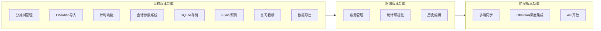
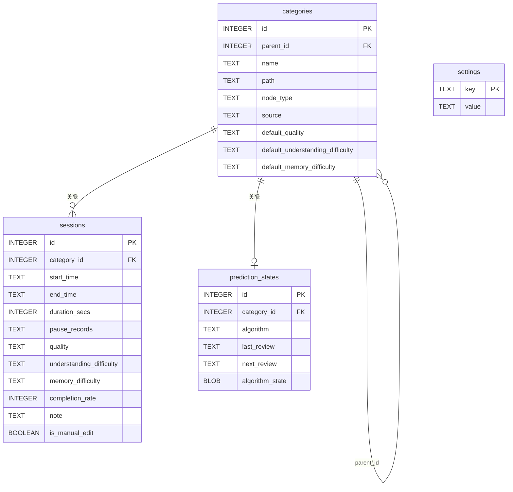
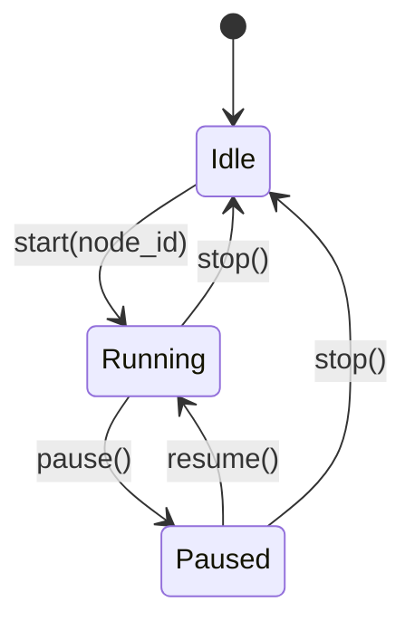
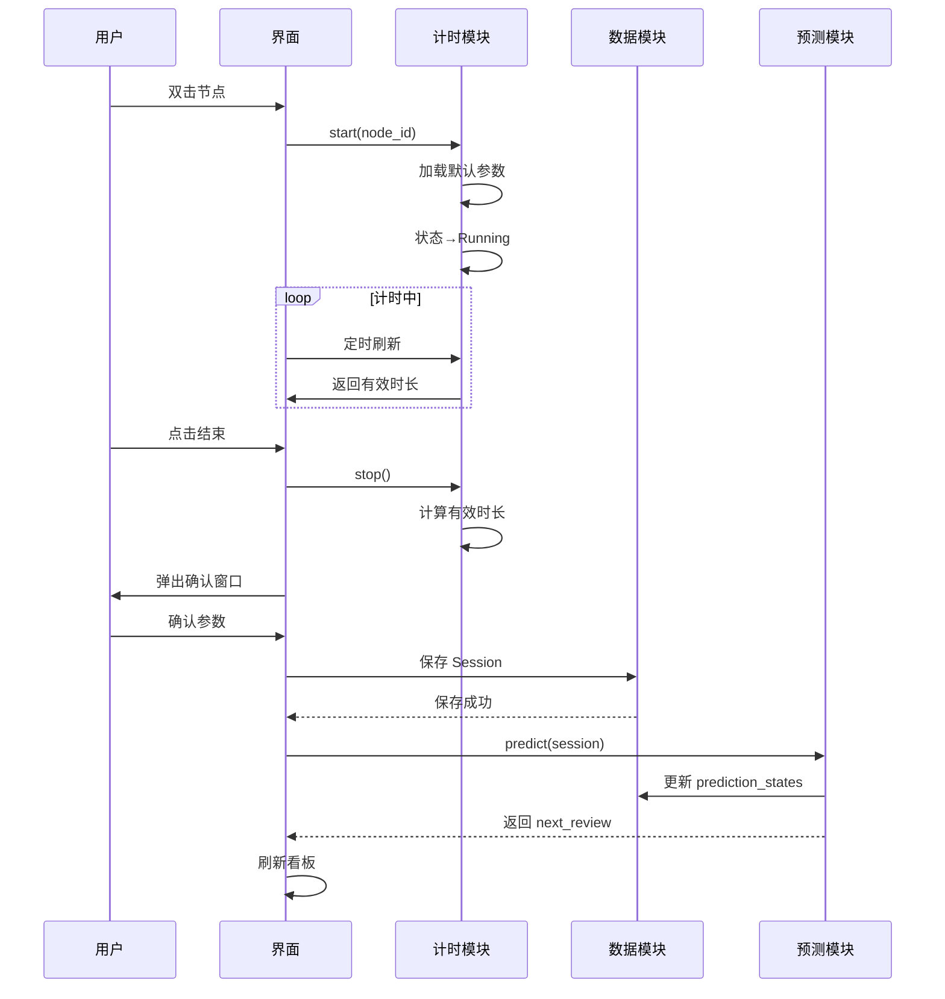
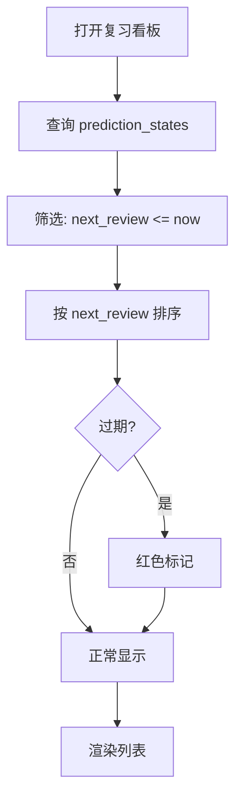
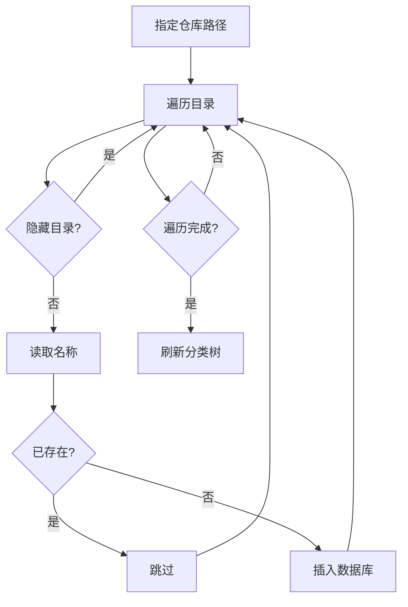

# 时间管理工具设计文档 v2

## 第一部分：概述

### 1.1 项目背景

现有时间管理工具存在以下问题：
- 功能割裂：日历、任务、记忆算法、笔记各自独立
- 输入成本高：需要在不同应用间手动搬运数据
- 学习时间追踪缺失：缺乏与间隔重复算法的深度集成

本项目旨在打造一个本地优先、输入成本极低的学习时间管理工具，核心功能围绕**学习时间追踪**和**基于 FSRS 的复习预测**展开。

### 1.2 项目目标

#### 核心目标
- 管理学习内容的层级分类树
- 以自由计时模式跟踪学习投入，支持暂停和参数记录
- 基于 FSRS 间隔重复算法自动预测下一次复习时间
- 提供复习看板，展示待复习任务及其紧迫度
- 保持用户数据完全本地化

#### 设计理念
- **本地优先**：所有数据存储在本地 SQLite 数据库，用户拥有完全控制权
- **低输入成本**：自动化时间记录，用户只需点击开始/结束
- **专注学习时间管理**：做好一件事，不过度扩展功能范围

### 1.3 开发路线图



## 第二部分：功能需求

### 2.1 核心工作流程

```
用户构建学习分类树 → 开启计时 → 结束记录会话数据 → 自动更新预测 → 复习看板展示
```

#### 详细流程
1. 用户构建学习分类树（可从 Obsidian 导入）
2. 用户选择分类节点，开启计时
3. 计时过程中可暂停/恢复
4. 计时结束后填写会话参数（质量、难度等）
5. 系统自动保存会话记录，调用 FSRS 算法更新预测
6. 复习看板按紧迫度展示待复习节点

### 2.2 功能模块划分

#### 2.2.1 学习时间管理模块（核心）

**分类树管理**
- 支持多层级树形结构
- 可从 Obsidian 知识库导入
- 支持手动创建、重命名、删除节点
- 节点分为"目录"和"学习节点"两种类型

**计时功能**
- 自由计时模式，无固定时长限制
- 支持暂停/恢复，暂停期间不计入有效时长
- 计时过程中使用默认参数，结束后可修改
- 实时显示当前节点名称和有效时间

**会话记录存储**
- 持久化存储时间、节点、参数、备注
- 支持手动编辑历史记录
- SQLite 数据库存储，可导出为 JSONL/CSV

**预测算法**
- 集成 FSRS 算法
- 每次会话结束后自动更新预测状态
- 为每个节点维护独立的预测状态

**复习看板**
- 展示所有待复习节点，按紧迫度排序
- 过期节点高亮提醒
- 可直接跳转进入计时

#### 2.2.2 数据管理模块

**数据导出**
- 一键导出会话记录和预测状态
- 支持 JSONL、CSV 格式
- 导出文件完全透明，可被第三方工具读取

#### 2.2.3 用户设置模块

**参数默认值配置**
- 全局默认参数
- 参数预设管理

## 第三部分：技术选型

| 组件 | 选择 | 理由 |
|------|------|------|
| 编程语言 | Rust | 内存安全、高性能、强类型系统 |
| GUI 框架 | Iced 0.14 | 纯 Rust 原生跨平台 GUI，TEA 架构 |
| 数据库 | rusqlite (SQLite) | 嵌入式、零配置、单文件存储 |
| 预测算法 | fsrs (Rust 库) | Anki 最新算法，通过 trait 抽象可扩展 |
| 日志框架 | tracing + tracing-subscriber | 结构化日志，异步友好，性能优秀 |
| Obsidian 解析 | walkdir | 只读取目录结构和文件名，轻量高效 |

## 第四部分：软件架构

### 4.1 模块架构

```
┌─────────────────────────────────────────────────────────┐
│                    time-manager                          │
├─────────────────────────────────────────────────────────┤
│                                                          │
│  全局模块                                                 │
│  ┌─────────┐  ┌─────────┐  ┌─────────┐  ┌─────────┐     │
│  │   UI    │  │  Data   │  │ Settings│  │   CLI   │     │
│  │  模块   │  │  模块   │  │  模块   │  │  模块   │     │
│  └────┬────┘  └────┬────┘  └────┬────┘  └────┬────┘     │
│       │            │            │            │           │
│  ┌────┴────────────┴────────────┴────────────┴────┐     │
│  │              功能模块                            │     │
│  │  ┌───────────────────────────────────────────┐ │     │
│  │  │        学习时间管理模块 (learning)         │ │     │
│  │  │  ┌──────────┐ ┌──────────┐ ┌──────────┐   │ │     │
│  │  │  │  timer   │ │ category │ │prediction│   │ │     │
│  │  │  └──────────┘ └──────────┘ └──────────┘   │ │     │
│  │  └───────────────────────────────────────────┘ │     │
│  └─────────────────────────────────────────────────┘     │
│                                                          │
└─────────────────────────────────────────────────────────┘
```

### 4.2 项目目录结构

```
time-manager/
├── Cargo.toml
├── src/
│   ├── main.rs                 # GUI 入口
│   ├── lib.rs                  # 库根
│   ├── app.rs                  # 主应用逻辑
│   ├── bin/
│   │   └── tmd-cli.rs          # CLI 工具
│   ├── data/                   # 数据访问模块
│   │   ├── database.rs         # SQLite 操作
│   │   ├── models.rs           # 数据模型
│   │   ├── error.rs            # 错误类型
│   │   └── export.rs           # 导出功能
│   ├── modules/
│   │   └── learning/           # 学习时间管理模块
│   │       ├── timer/          # 计时子模块
│   │       │   ├── state_machine.rs
│   │       │   ├── session.rs
│   │       │   └── params.rs
│   │       ├── category/       # 分类树子模块
│   │       │   ├── tree.rs
│   │       │   └── obsidian/
│   │       │       └── vault_parser.rs
│   │       └── prediction/     # 预测算法子模块
│   │           ├── algorithm.rs
│   │           └── fsrs/
│   │               ├── adapter.rs
│   │               ├── mapper.rs
│   │               └── state.rs
│   └── settings/               # 设置模块
│       └── defaults.rs
└── tests/
    ├── data_tests.rs
    └── learning_tests.rs
```

### 4.3 设计模式应用

| 模式 | 应用场景 | 实现 |
|------|----------|------|
| 状态模式 | 计时状态管理 | TimerState enum: Idle/Running/Paused |
| 策略模式 | 预测算法可替换 | PredictionAlgorithm trait |
| 适配器模式 | 参数映射 | FSRS ParamMapper |
| 组合模式 | 分类树结构 | CategoryNode 递归结构 |
| 模板方法模式 | 数据导出 | Exporter trait |

## 第五部分：详细设计

### 5.1 数据模型

#### ER 图



#### 核心数据结构

**Category（分类节点）**
- 目录类型：用于组织结构
- 学习节点类型：可关联会话记录和预测状态
- 支持默认参数覆盖

**Session（会话记录）**
- 时间数据：start_time, end_time, duration_secs
- 暂停记录：pause_records (JSON 数组)
- 参数数据：quality, understanding_difficulty, memory_difficulty, completion_rate
- 备注：note, is_manual_edit

**PredictionState（预测状态）**
- 算法标识：algorithm
- 时间数据：last_review, next_review
- 算法状态：algorithm_state (二进制序列化)

### 5.2 计时状态机



**状态转换逻辑**

| 转换 | 触发条件 | 数据变化 |
|------|----------|----------|
| Idle→Running | start(node_id) | 记录 start_time，初始化参数 |
| Running→Paused | pause() | 记录 pause_start |
| Paused→Running | resume() | 记录 pause_end，累加暂停时长 |
| *→Idle | stop() | 计算 duration_secs，保存会话 |

### 5.3 预测算法接口

```rust
pub trait PredictionAlgorithm: Send + Sync {
    fn predict_next_review(
        &self,
        session_history: &[Session],
        algorithm_state: &[u8],
        quality: &Quality,
    ) -> PredictionResult;
    
    fn algorithm_name(&self) -> &'static str;
}

pub struct PredictionResult {
    pub next_review: DateTime<Utc>,
    pub state_bytes: Vec<u8>,
}
```

**FSRS 参数映射**

| 会话参数 | FSRS 映射 |
|----------|-----------|
| 学习质量 | Rating: 极低→Again, 低→Again, 中→Hard, 高→Good, 完整→Easy |
| 记忆难度 | 影响初始 stability |
| 理解难度 | 影响初始 difficulty |

### 5.4 会话参数系统

#### 参数定义

| 参数 | 类型 | 值域 | 说明 |
|------|------|------|------|
| 学习质量 | 枚举 | 极低/低/中/高/完整 | 专注度与理解程度 |
| 理解难度 | 枚举 | 极易/易/中/难/极难 | 内容理解门槛 |
| 记忆难度 | 枚举 | 极易/易/中/难/极难 | 内容记忆负荷 |
| 完成度 | 百分比 | 0-100% | 计划完成比例 |

#### 参数默认值层级

```
全局默认参数 (settings 表)
    └── 节点覆盖参数 (categories 表字段)
```

#### 参数预设

预设是参数值的组合，可在会话确认窗口快速应用。

**内置预设**

| 预设名 | 学习质量 | 理解难度 | 记忆难度 | 完成度 |
|--------|----------|----------|----------|--------|
| 专注学习 | 高 | 中 | 中 | 100% |
| 轻松复习 | 中 | 易 | 易 | 80% |
| 快速浏览 | 低 | 易 | 易 | 50% |

### 5.5 UI 设计

#### 界面布局

**分类树界面**
- 左侧：树形控件，显示分类层级
- 右侧：选中节点详情面板（统计、预测信息）
- 顶部：操作按钮（搜索、导入、新建）
- 底部：导航栏

**复习看板界面**
- 左侧：节点列表，按紧迫度排序
  - 🔴 过期节点
  - 🟡 今日到期
  - ⚪ 未来到期
- 右侧：选中节点详情面板
- 点击"开始计时"直接进入计时

**计时界面**
- 中央大号时间显示
- 当前节点名称
- 暂停/继续按钮
- 结束按钮

**会话确认窗口**
- 节点名称、有效时长
- 参数设置区域
- 预设选择按钮
- 取消/保存按钮

#### 交互方式

| 操作 | 方式 |
|------|------|
| 选择节点 | 单击 |
| 启动计时 | 双击节点 或 详情面板"开始计时" |
| 暂停/继续 | 界面按钮 |
| 结束计时 | 界面按钮 |
| 修改参数 | 会话确认窗口 |

## 第六部分：核心流程

### 6.1 会话完整流程



### 6.2 复习看板查询流程



### 6.3 Obsidian 导入流程



## 第七部分：测试策略

### 7.1 单元测试

- 计时状态机：状态转换合法性、时长计算准确性
- 预测算法：FSRS 适配器、参数映射逻辑
- 参数系统：默认值层级、参数有效性
- 数据访问层：CRUD 操作、边界条件
- Obsidian 解析器：目录结构解析

### 7.2 集成测试

- 完整会话流程：从开始到结束的数据流
- 复习看板查询：筛选和排序正确性
- 数据导出：文件内容与数据库一致性

### 7.3 CLI 测试接口

```bash
tmd-cli status                    # 当前状态
tmd-cli list-due                  # 到期预测列表
tmd-cli stats                     # 统计信息
tmd-cli export jsonl              # 导出数据
tmd-cli import-obsidian <path>    # 导入 Obsidian
```

## 第八部分：部署

### 8.1 编译

```bash
cargo build --release
```

生成单一可执行文件，无需额外依赖。

### 8.2 数据存储位置

**Linux (XDG 规范)**
- 可执行文件：`~/.local/bin/`
- 数据文件：`~/.local/share/time-manager/data/`
- 配置文件：`~/.config/time-manager/`

**Windows**
- 可执行文件：`%LOCALAPPDATA%\Programs\time-manager\`
- 数据文件：`%LOCALAPPDATA%\time-manager\data\`
- 配置文件：`%APPDATA%\time-manager\config\`

**macOS**
- 可执行文件：`/Applications/time-manager.app/Contents/MacOS/`
- 数据文件：`~/Library/Application Support/time-manager/data/`
- 配置文件：`~/Library/Application Support/time-manager/config/`

## 第九部分：日志系统

### 9.1 日志框架

使用 `tracing` + `tracing-subscriber`，提供结构化日志输出。

### 9.2 日志级别配置

```
time_manager=debug    # 项目核心库
tmd_cli=debug         # CLI 工具
fsrs=debug            # FSRS 算法库
info                  # 其他依赖
```

### 9.3 日志覆盖模块

| 模块 | 日志内容 |
|------|----------|
| database.rs | 数据库连接、迁移、CRUD 操作 |
| app.rs | 状态转换、计时操作、会话处理 |
| state_machine.rs | 计时状态变化 |
| algorithm.rs | 预测算法调用 |
| fsrs/adapter.rs | FSRS 算法计算细节 |
| tree.rs | 分类树构建 |
| vault_parser.rs | Obsidian 导入解析 |

### 9.4 使用方式

```bash
# 默认配置（debug 级别）
cargo run --bin tmd-cli -- status

# 详细追踪
RUST_LOG=trace cargo run --bin tmd-cli -- status

# 仅关键信息
RUST_LOG=info cargo run --bin tmd-cli -- status
```

## 第十部分：用户手册

### 10.1 快速开始

1. 启动程序
2. 导入学习内容（Obsidian 或手动创建）
3. 双击节点开始计时
4. 结束时确认参数并保存
5. 在复习看板查看待复习内容

### 10.2 数据备份

定期备份 `data/` 文件夹，包含：
- `app.db`：SQLite 数据库
- `archive/`：导出的存档文件

---

## 附录：变更日志

| 版本 | 日期 | 变更内容 |
|------|------|----------|
| v2.0 | 2026-05-31 | 基于 FIX_3.md 重新设计，精简为核心功能 |
| v1.0 | 2026-05-27 | 初始设计文档 |
