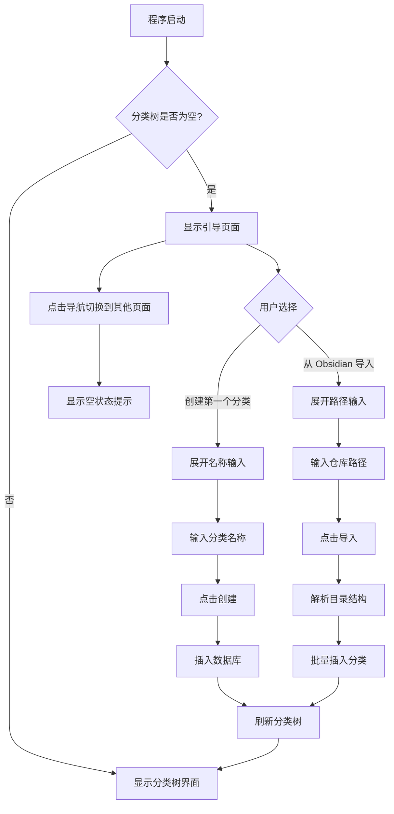
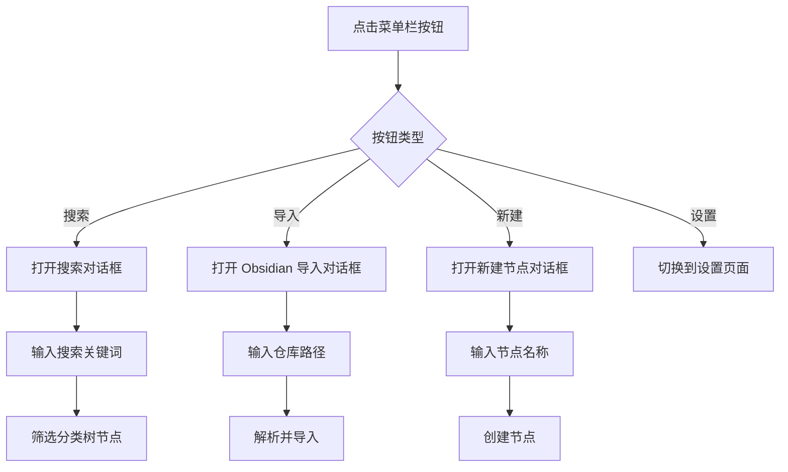

# FIX_1: 初始化引导流程与顶部菜单栏

## 问题描述

程序首次启动时数据库为空，分类树界面仅显示"暂无分类"，用户无法进行任何操作——没有创建分类的入口，没有导入数据的引导，整个应用处于不可用状态。需要：

1. 添加初始化引导流程，引导用户创建第一个分类或从 Obsidian 导入
2. 添加顶部菜单栏，提供操作入口（当前导航栏在底部且功能单一）

## 设计方案

### 1. 顶部菜单栏

替换当前底部导航栏，移至顶部，分为两部分：左侧为页面导航标签，右侧为当前页面操作按钮。

```
┌──────────────────────────────────────────────────────────────────┐
│  [分类树]  [复习看板]  [计时]              [搜索] [导入] [设置]    │
├──────────────────────────────────────────────────────────────────┤
│                                                                  │
│  （页面内容区域）                                                  │
│                                                                  │
└──────────────────────────────────────────────────────────────────┘
```

**结构定义：**

| 区域 | 内容 | 说明 |
|------|------|------|
| 左侧导航标签 | 分类树 / 复习看板 / 计时 | 当前页面高亮，点击切换 |
| 右侧操作按钮 | 因页面而异 | 分类树页面：搜索、导入、设置；复习看板页面：刷新、筛选；计时页面：无 |

**各页面操作按钮：**

| 页面 | 操作按钮 |
|------|----------|
| 分类树 | [搜索] [从 Obsidian 导入] [新建节点] [设置] |
| 复习看板 | [刷新] [筛选] |
| 计时 | 无额外操作 |

### 2. 初始化引导流程

#### 2.1 判断条件

`App::new()` 时检测 `forest.roots.is_empty()`，若为真则进入引导状态。

#### 2.2 引导页面设计

```
┌──────────────────────────────────────────────────────────────────┐
│  [分类树]  [复习看板]  [计时]                                      │
├──────────────────────────────────────────────────────────────────┤
│                                                                  │
│                                                                  │
│                    欢迎使用 Time Manager                          │
│                                                                  │
│              开始跟踪你的学习时间，建立复习节奏。                    │
│                                                                  │
│         ┌─────────────────────┐  ┌─────────────────────┐        │
│         │                     │  │                     │        │
│         │   创建第一个分类     │  │  从 Obsidian 导入    │        │
│         │                     │  │                     │        │
│         └─────────────────────┘  └─────────────────────┘        │
│                                                                  │
│                                                                  │
│         你也可以稍后在菜单栏中操作。                                │
│                                                                  │
│                                                                  │
└──────────────────────────────────────────────────────────────────┘
```

**交互方式：**
- 点击"创建第一个分类"：弹出新建节点对话框（内联输入框 + 确认按钮）
- 点击"从 Obsidian 导入"：弹出导入对话框（路径输入 + 确认按钮）
- 顶部导航标签仍可点击，但复习看板和计时页面在无分类时显示空状态提示

#### 2.3 新建节点对话框（内联）

点击"创建第一个分类"后在引导页面内展开输入区域：

```
┌──────────────────────────────────────────────────────────────────┐
│  [分类树]  [复习看板]  [计时]                                      │
├──────────────────────────────────────────────────────────────────┤
│                                                                  │
│                    欢迎使用 Time Manager                          │
│                                                                  │
│         ┌─────────────────────────────────────────────┐         │
│         │  分类名称: [________________________]        │         │
│         │                                             │         │
│         │            [取消]  [创建]                     │         │
│         └─────────────────────────────────────────────┘         │
│                                                                  │
│         ┌─────────────────────┐                                  │
│         │  从 Obsidian 导入    │                                  │
│         └─────────────────────┘                                  │
│                                                                  │
└──────────────────────────────────────────────────────────────────┘
```

创建成功后自动刷新分类树，引导页面消失，进入正常分类树界面。

#### 2.4 Obsidian 导入对话框（内联）

点击"从 Obsidian 导入"后在引导页面内展开路径输入区域：

```
┌──────────────────────────────────────────────────────────────────┐
│  [分类树]  [复习看板]  [计时]                                      │
├──────────────────────────────────────────────────────────────────┤
│                                                                  │
│                    欢迎使用 Time Manager                          │
│                                                                  │
│         ┌─────────────────────┐                                  │
│         │  创建第一个分类       │                                  │
│         └─────────────────────┘                                  │
│                                                                  │
│         ┌─────────────────────────────────────────────┐         │
│         │  仓库路径: [________________________]        │         │
│         │                                             │         │
│         │            [取消]  [导入]                     │         │
│         └─────────────────────────────────────────────┘         │
│                                                                  │
└──────────────────────────────────────────────────────────────────┘
```

导入成功后自动刷新分类树，引导页面消失。

### 3. 状态模型变更

#### 3.1 Screen 枚举扩展

```rust
#[derive(Debug, Clone)]
pub enum Screen {
    CategoryTree,
    ReviewDashboard,
    Timer,
}
```

不变。引导流程不作为独立 Screen，而是作为 `CategoryTree` 页面在 `forest.roots.is_empty()` 时的替代渲染。

#### 3.2 Message 枚举扩展

```rust
#[derive(Debug, Clone)]
pub enum Message {
    // 现有消息 ...

    // 菜单栏操作
    OpenSearch,                    // 打开搜索
    OpenImport,                    // 打开 Obsidian 导入对话框
    OpenNewCategory,               // 打开新建节点对话框
    OpenSettings,                  // 打开设置界面
    RefreshReviewDashboard,        // 刷新复习看板（已存在）

    // 引导 / 对话框
    CreateRootCategory,            // 确认创建根分类
    ImportObsidian,                // 确认导入 Obsidian
    SetNewCategoryName(String),    // 输入新分类名称
    SetObsidianPath(String),       // 输入 Obsidian 路径
    DismissDialog,                 // 关闭当前对话框
}
```

#### 3.3 App 结构体扩展

```rust
pub struct App {
    // 现有字段 ...

    // 新增
    dialog: Option<Dialog>,        // 当前打开的对话框
}

#[derive(Debug, Clone)]
pub enum Dialog {
    NewCategory {
        parent_id: Option<i64>,    // None = 根节点
        name: String,
    },
    ObsidianImport {
        path: String,
    },
    Search {
        query: String,
    },
}
```

### 4. 视图渲染逻辑

#### 4.1 view() 方法变更

```
view():
  1. 渲染顶部菜单栏（导航标签 + 操作按钮）
  2. 若 dialog 存在 → 叠加对话框层
  3. 否则渲染页面内容:
     - CategoryTree: 若 forest.roots 为空 → 渲染引导页面；否则渲染分类树
     - ReviewDashboard: 渲染复习看板
     - Timer: 渲染计时界面
```

#### 4.2 菜单栏渲染

当前 `view_nav_bar()` 改为 `view_menu_bar()`，布局从 `row` 底部排列改为顶部两段式布局：

- 左侧：页面导航标签
- 右侧：当前页面的操作按钮

当前页面为 `CategoryTree` 时，右侧显示 `[搜索] [导入] [新建] [设置]`。
当前页面为 `ReviewDashboard` 时，右侧显示 `[刷新]`。
当前页面为 `Timer` 时，右侧无操作按钮。

### 5. 流程图

#### 5.1 首次启动引导流程



#### 5.2 菜单栏操作流程



### 6. 空状态提示

当用户从引导页面切换到其他页面时，应显示有意义的空状态提示：

| 页面 | 空状态文案 |
|------|-----------|
| 复习看板（无分类） | "暂无分类。请先在分类树中添加学习内容。" |
| 复习看板（有分类，无待复习） | "暂无待复习项目。" |
| 计时（未选中节点） | "请先在分类树中选择一个节点开始计时。" |

### 7. 实现优先级

1. 顶部菜单栏（替换底部导航栏）
2. 引导页面渲染逻辑（`forest.roots.is_empty()` 分支）
3. Dialog 状态与新建节点对话框
4. Obsidian 导入对话框
5. 搜索对话框
